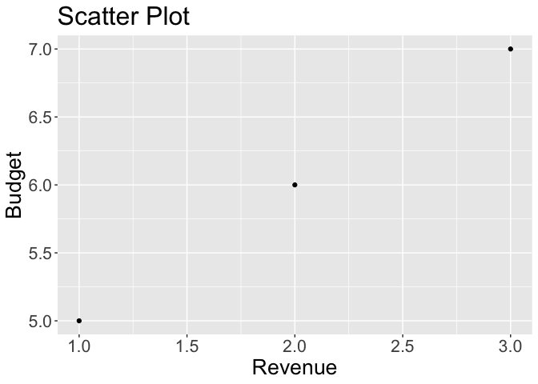
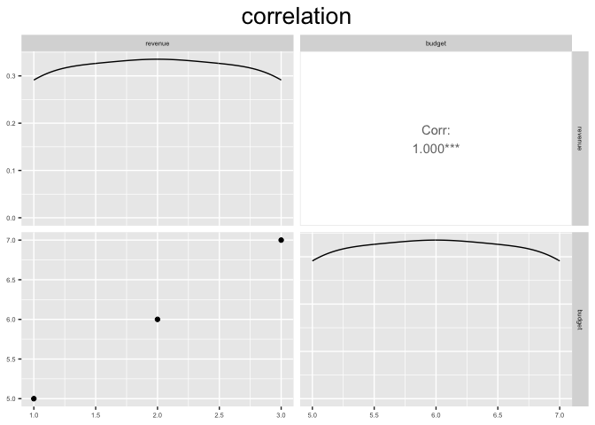

<!-- README.md is generated from README.Rmd. Please edit that file -->

# Movie

<!-- badges: start -->

- 
  <!-- badges: end -->

The goal of Movie is to provide the user with common useful functions
that are useful for reproducing the Movie Budget Analysis

## Installation

You can install the development version of Movie from
[GitHub](https://github.com/) with:

``` r
# install.packages("devtools")
devtools::install_github("DSCI-310/dsci-310-group-08-pkg")
```

## Example

This is a basic example which shows you how to solve a common problem:

``` r
library(Movie)
## basic example code for downloading a dataset
path <- "https://github.com/rehan13/ownprac/blob/main/testsheet.csv"
out_dir <- tempfile()
dataset <- read_dataset(path, out_dir)
```

Another example is how you can clean data.

``` r
# Given a dummy data called test_df
test_df <- data.frame(col1 = c(1, 2, 3),
                      col2 = c(4, 5, 6),
                      col3 = c(7, 8, 9))


# Running EDA function for testing
eda_df <- EDA(test_df, select_cols = c("col1", "col2"), col1 > 1, col2 > 5)
eda_df
#>   col1 col2
#> 1    3    6
```

We can also generate plots using the function in this library. But first
we will take a test_df here to use for both plots

``` r
data_test <- data.frame(
  revenue = c(1,2,3),
  budget = c(5,6,7)
)
```

Now we are going to make a scatter plot and correlation plot with this
data frame.

``` r
scatter_plot = plot_scatter_graph(data=data_test,
                                  x_axis_data=revenue,
                                  y_axis_data=budget, x_axis_label="Revenue",
                                  y_axis_label="Budget", title_label = "Scatter Plot", text_size=20)
scatter_plot
```



``` r
correlation_plot = correlation_plot(data_test, "correlation")
#> Registered S3 method overwritten by 'GGally':
#>   method from   
#>   +.gg   ggplot2
correlation_plot
```


